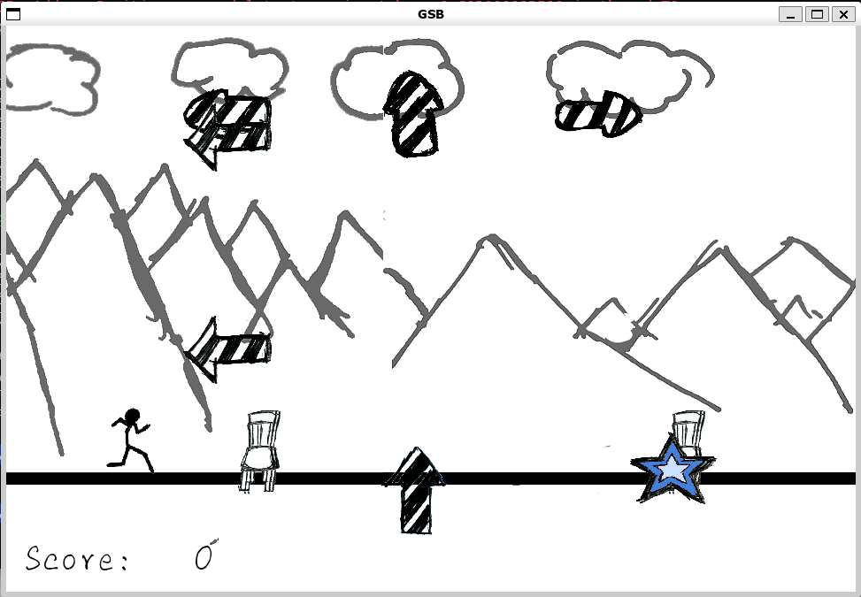

# 勇往直前 GSB

> 2019-2020学年春季学期，《Linux环境及开发工具应用实践 》课程大作业
>
> 大一下的时候水平有限，十分稀烂，凑合看看

## 游戏简介

`勇往直前GSB`，是一款仿音游小游戏，同时考察“多线程”能力。  



用户需要通过键盘（`A`, `S`, `D` 键）完成对箭头的响应，同时使用鼠标点击蓝色的星星。

（原本设计中箭头的相应和地平线的障碍物甚至是分开的，但为了降低难度，砍去这个环节）

同时辅以嘈杂的音乐，锻炼“一心多用”能力。

## 编译方式

#### 前期准备

你需要在环境中安装好：

- libsdl2-dev
- libsdl2-mixer-dev
- libsdl2-image-dev
- libsdl2-ttf-dev

#### 编译软件

进入 `src` 文件夹后，直接运行写好的 `Makefile` 文件：

```shell
make
```

随后会产生二进制文件，名字为 `main` 。

#### 运行软件

直接运行对应的二进制文件即可。
